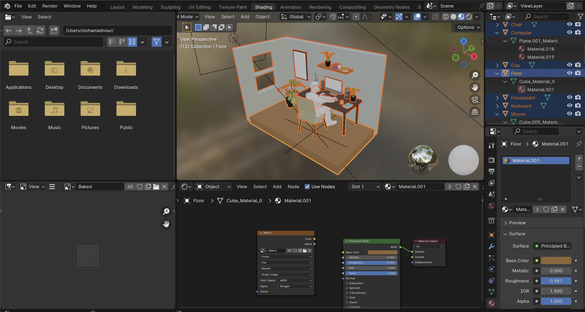
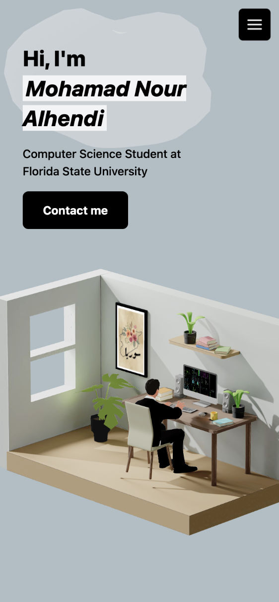
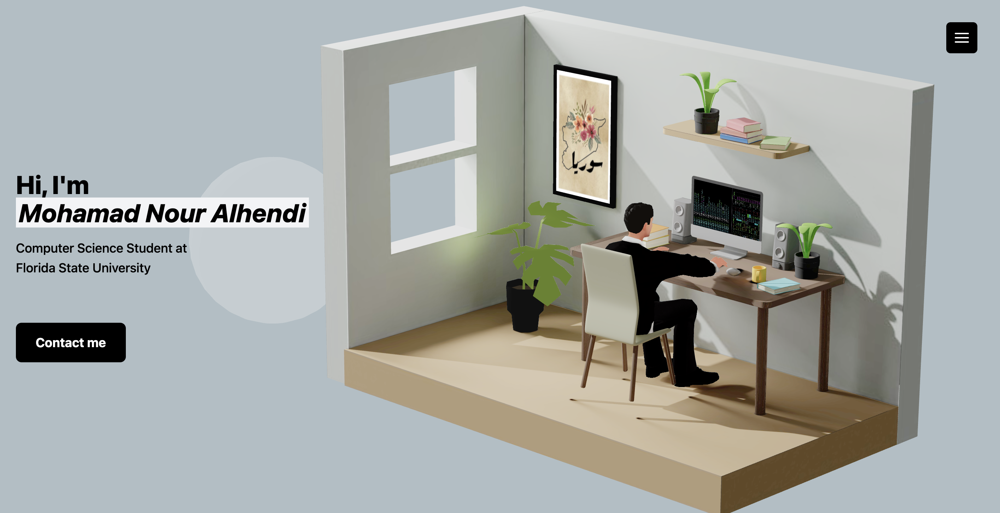

To view my project, visit: [My Portfolio](https://nour29110.github.io/My-Portfolio/)

# My 3D Portfolio Website  

This project is a **3D Portfolio Website** built using **React Three Fiber**, showcasing interactive 3D models, animations, and responsive design.

## 3D Model Creation with Blender  
The 3D model featured in this project was designed and animated using **Blender**, an open-source 3D creation tool. After creating and optimizing the model, it was exported and integrated into the project using **React Three Fiber**. This integration allowed for smooth rendering and interactivity directly within the browser.  

  

## Responsive Design  
The website is fully responsive, providing a seamless user experience across devices, from mobile phones to large desktop screens.

  

## Final Portfolio  
The portfolio features a custom animated avatar resembling me, along with interactive 3D elements and a professional design.

  

